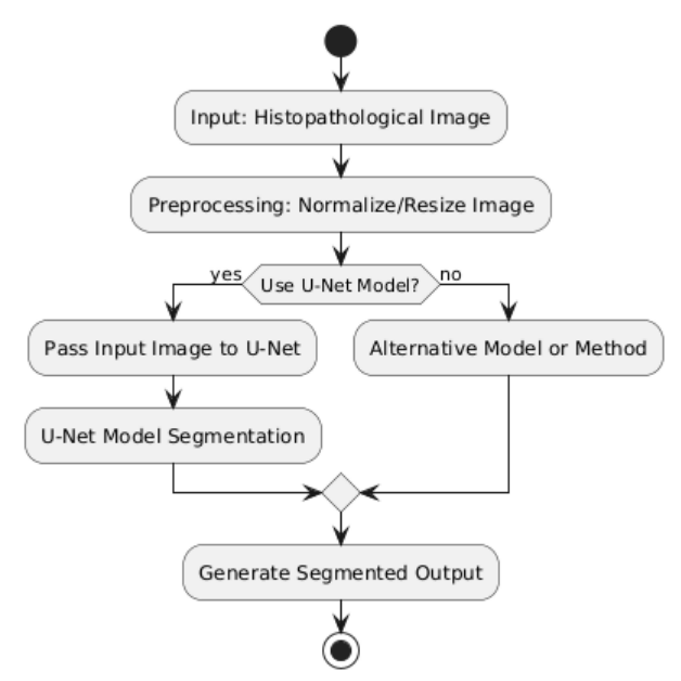
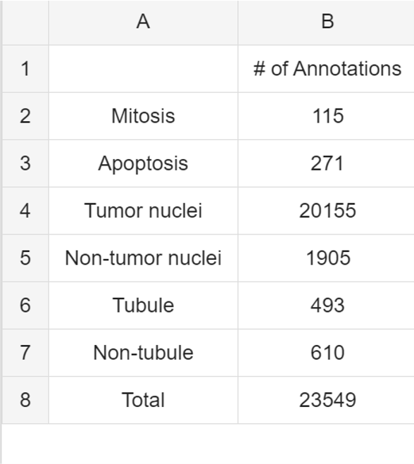
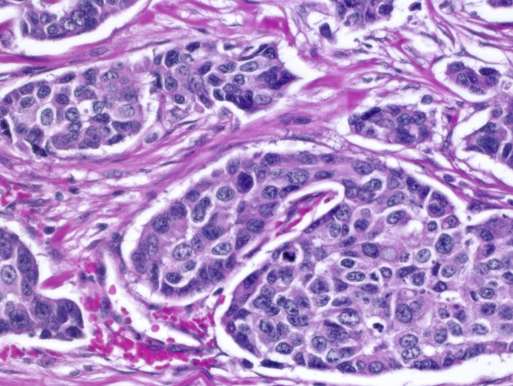
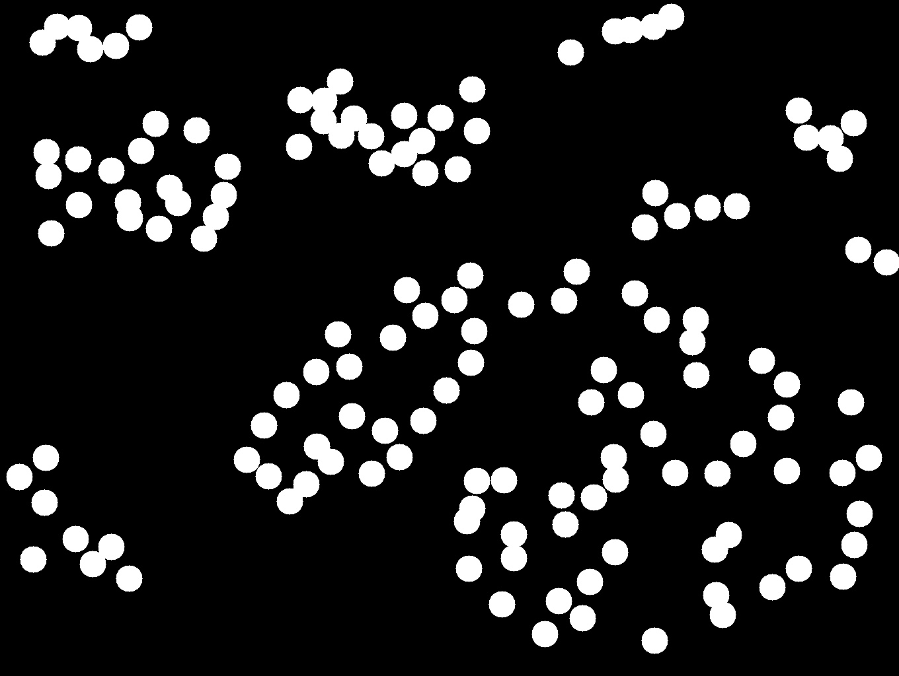
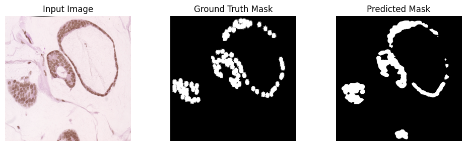
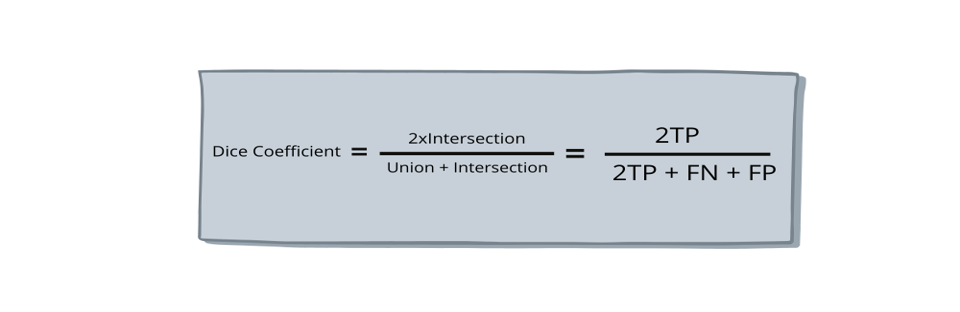

# Histopathological Image Segmentation for Accurate Cancer Detection

## Introduction
This project focuses on the segmentation of breast cancer histopathology images using the U-Net architecture, a widely recognized model in the field of biomedical image analysis. Accurate segmentation of these images is crucial for identifying and localizing cancerous cells, ultimately aiding pathologists in making more informed diagnoses and treatment decisions.

Histopathological images are complex and often contain subtle differences between cancerous and non-cancerous tissue, making manual analysis time-consuming and prone to human error. By employing deep learning techniques, particularly convolutional neural networks (CNNs) like U-Net, this project aims to automate the segmentation process, enhancing both precision and efficiency.

The U-Net model is specifically designed for biomedical image segmentation tasks, featuring an encoder-decoder structure that captures context and enables precise localization. Through this project, we aim to leverage the power of deep learning to contribute to the field of medical diagnostics, ultimately improving patient outcomes.

In addition to model implementation, the project includes comprehensive evaluation metrics and visualizations to assess model performance, making it a valuable resource for researchers and practitioners in the domain of medical image analysis.

## U-Net Architecture
The U-Net architecture is a powerful convolutional neural network designed specifically for image segmentation tasks, particularly in biomedical applications. Its unique structure enables precise localization and context capture, making it ideal for segmenting breast cancer histopathology images.

### Architecture Overview
The U-Net architecture consists of two main components: the **contracting path** (encoder) and the **expanding path** (decoder). 

1. **Contracting Path (Encoder):**
   - The encoder progressively captures high-level features of the input image through a series of convolutional and max-pooling layers.
   - Each convolutional block consists of two 3x3 convolutional layers followed by a ReLU activation function, effectively extracting features while maintaining spatial hierarchies.
   - After each block, max pooling (2x2) is applied to downsample the feature maps, allowing the network to learn increasingly abstract representations.
   - This path reduces the spatial dimensions while increasing the number of feature channels, effectively capturing context about the image.

2. **Bottleneck:**
   - At the bottom of the U, a bottleneck layer connects the contracting and expanding paths. This layer further processes the feature maps before transitioning to the decoder, allowing for a more sophisticated representation of the image features.

3. **Expanding Path (Decoder):**
   - The decoder up-samples the feature maps using transposed convolutions, effectively reconstructing the spatial dimensions of the input image.
   - Each upsampling step is followed by a concatenation with the corresponding feature maps from the encoder. This skip connection preserves spatial information lost during downsampling, enhancing localization accuracy.
   - The decoder consists of convolutional blocks that refine the feature maps, enabling the model to make precise predictions about the segmentation.

4. **Output Layer:**
   - The final layer uses a 1x1 convolution to produce the output segmentation map, where each pixel corresponds to a class label (e.g., cancerous or non-cancerous tissue).

### Project Application
In this project, the U-Net architecture is employed to segment breast cancer histopathology images, allowing for the identification and localization of cancerous regions. By leveraging the model's ability to capture both global context and local details, we aim to enhance the accuracy of cancer detection, ultimately contributing to improved diagnostic processes in pathology.

## Goals

The main goal of this project is to develop a robust U-Net model for accurately segmenting histopathological images to assist in breast cancer detection. Key objectives include:

1. **Accurate Segmentation**: Achieve precise delineation of cancerous tissues from healthy ones, enhancing diagnostic accuracy.
  
2. **Robust Training**: Train the model on a diverse dataset to ensure it generalizes well across different cases.

3. **Performance Evaluation**: Use metrics like IoU and Dice Coefficient to assess and improve the model's performance.

4. **Efficient Implementation**: Utilize mixed precision training for faster training and reduced memory usage.

5. **User Accessibility**: Provide clear documentation for easy installation and usage, making the project accessible to other researchers and practitioners.

By focusing on these goals, the project aims to contribute to the advancement of AI in healthcare, specifically in improving breast cancer diagnosis.

## Project Objective
This study aims to improve cancer detection by leveraging deep learning for accurate segmentation of histopathological images. Our goal is to develop a CNN model that precisely distinguishes cancerous from non-cancerous tissue, reducing human error and aiding early diagnosis.

## Datasets

The dataset used in this project is the **BreCaHAD** (Breast Cancer Histopathological Annotation and Diagnosis) dataset. This dataset is pivotal for researchers aiming to optimize and evaluate the effectiveness of their proposed methods in the field of breast cancer histopathology. Here are the details:

- **Total Images**: The dataset consists of **162 high-resolution histopathology images**, originally in **.tif** format. These images cover a range of malignant cases, making them suitable for comprehensive research and analysis.

- **Labels**: Each image is accompanied by ground truth labels in **JSON** format, which specify the coordinates of segmented lesions. These annotations are crucial for training segmentation models, allowing them to learn the precise areas of interest within the images.

### Dataset Processing

1. **TIF to JPG Conversion**:
   - All **.tif** images have been converted to **.jpg** format. This conversion not only enhances compatibility with various image processing libraries but also maintains the integrity and quality of the images.

2. **Mask Creation**:
   - Masks are generated from the JSON files by extracting the coordinates of segmented regions. Circular masks are created using the OpenCV library, highlighting the areas that contain significant pathological features. This step is essential for training the segmentation model, as it provides clear visual targets for the algorithm.

3. **Data Augmentation**:
   - To enhance the robustness of the model and increase the dataset size to **2592 images**, various augmentation techniques have been employed. These techniques include:
     - **Horizontal & Vertical Flips**: These transformations introduce variability in the orientation of the images, helping the model generalize better to different viewing angles.
     - **Rotation**: Images are rotated by specified angles to further diversify their appearance, simulating various real-world scenarios that a model may encounter.
     - **Elastic Deformation**: This technique applies small, randomized elastic transformations to the images, simulating natural variability and improving the model's ability to handle minor distortions.
     - **Distortions**: Gaussian-based distortions are introduced to create warping effects, helping the model learn to recognize features under varying conditions.
     - **Barrel & Pincushion Distortions**: These distortions simulate lens effects that can occur during image capture, ensuring that the model is resilient to such variations.
     - **Resizing & Shrinking**: Adjustments are made to augment scale variations, which is crucial for training models to recognize structures of different sizes.

The combination of high-quality images, precise annotations, and a robust augmentation pipeline ensures that the model is trained on diverse and representative data. This is vital for achieving accurate segmentation results in breast cancer histopathology, ultimately contributing to improved diagnostic outcomes.

### Dataset References

- **BreCaHAD Dataset Paper**: 
  - Aksac, A., Demetrick, D.J., Ozyer, T. et al. BreCaHAD: a dataset for breast cancer histopathological annotation and diagnosis. *BMC Research Notes* 12, 82 (2019). [Link to Paper](https://doi.org/10.1186/s13104-019-4121-7)

- **Original Data**: 
  -<a href="https://figshare.com/articles/dataset/BreCaHAD_A_Dataset_for_Breast_Cancer_Histopathological_Annotation_and_Diagnosis/7379186" target="_blank">BreCaHAD Dataset on Figshare</a>

## Training
## Training Process

The training of the segmentation model is executed using PyTorch and follows a systematic approach. The dataset is augmented to enhance the model's robustness against overfitting and to improve its generalization capabilities. Below are the key components of the training process:

### Data Augmentation

To improve the performance of the model, the training images undergo augmentation. This technique applies random transformations such as rotations, flips, and color adjustments, creating variations in the input images, which helps the model learn more generalized features.

### Training Configuration

- **Batch Size**: The model processes images in batches of 8. This allows for efficient memory utilization while maintaining the model's performance.
- **Optimizer**: The Adam optimizer is employed for its adaptive learning rate capabilities, allowing for faster convergence during training.
- **Loss Function**: Binary Cross-Entropy with Logits Loss (`BCEWithLogitsLoss`) is used, which is suitable for binary segmentation tasks.

### Checkpointing

The training process incorporates a checkpointing method, which saves the model's state at the end of each epoch. The checkpoint includes the model parameters, optimizer state, current epoch, and the loss and accuracy achieved during that epoch. This allows for:

- **Resumption of Training**: If training is interrupted, it can be resumed from the last saved checkpoint.
- **Best Model Selection**: The model evaluates its performance based on accuracy after each epoch, and only the best-performing model is retained for future inference. This helps in preventing overfitting and ensures that the model used for inference is the one with the highest accuracy.

### Training Loop

The training loop iterates over the specified number of epochs (10 in this case). For each epoch:

1. The model processes all batches of training data:
    - Each batch is moved to the designated device (GPU or CPU).
    - The model performs a forward pass to obtain predictions.
    - The loss is computed based on the predictions and true labels.
    - The accuracy is calculated to assess the model's performance.

2. The optimizer performs a backward pass to update the model weights based on the computed loss.

3. Checkpoint saving is performed if the average accuracy for the epoch exceeds the best recorded accuracy.

### Training platform
Used collab premium with T4 GPUand high memory to train.

### Example Code Snippet

Here's a brief snippet that outlines the training loop:

python
for epoch in range(start_epoch, 10):
    epoch_loss = 0
    total_accuracy = 0

    for batch_idx, (images, labels) in enumerate(tqdm(train_loader)):
        images = images.to(device)
        labels = labels.to(device)

        # Forward pass
        output = model(images)
        loss = criterion(output, labels)
        epoch_loss += loss.item()

        accuracy = calculate_accuracy(output, labels)
        total_accuracy += accuracy

        # Backward pass and optimization
        optimizer.zero_grad()
        loss.backward()
        optimizer.step()

        # Checkpoint saving
        if avg_accuracy > best_accuracy:
            best_accuracy = avg_accuracy
            save_checkpoint(model, optimizer, epoch, epoch_loss / len(train_loader), avg_accuracy, checkpoint_dir)

## Results

### Output Image

Below is an output image from the breast cancer histopathology segmentation model. This image illustrates the model's performance in segmenting cancerous tissues.

### Caption
**Figure 1**: Segmentation output of the breast cancer histopathology image. 

- **Left Panel**: The original input image, showing the histopathological sample.
- **Middle Panel**: The ground truth mask, representing the manually annotated regions indicating cancerous tissues.
- **Right Panel**: The predicted mask generated by the model, highlighting the regions classified as cancerous.

This output showcases the model's ability to effectively identify and segment cancerous regions within histopathological images, providing valuable insights to assist pathologists in automated diagnostics.

The performance of the segmentation model was evaluated using two primary metrics: **Accuracy** and the **Dice Coefficient**. These metrics provide insight into the model's effectiveness in accurately segmenting breast cancer histopathology images.

### Training Accuracy

During the training phase, the model achieved a training accuracy of **92.22%**. This high accuracy indicates that the model learned to identify features relevant to segmentation effectively from the training dataset. The training accuracy reflects the model's ability to minimize loss and generalize well to the training data.

### Test Accuracy

After completing the training process, the model was evaluated on a separate test dataset, yielding a test accuracy of **89.84%**. Although this accuracy is slightly lower than the training accuracy, it still demonstrates that the model maintains a strong performance when exposed to unseen data. 

### Average Dice Coefficient

The model also produced an **Average Dice Coefficient** of **0.5645** during testing. The Dice Coefficient is a measure of the overlap between the predicted segmentation masks and the ground truth masks. It ranges from 0 to 1, where a value of 1 indicates perfect overlap. 

- An average Dice Coefficient of **0.5645** suggests that while the model does capture a reasonable amount of relevant features for segmentation, there is still room for improvement. A value below 0.6 typically indicates that the model may struggle with certain cases, potentially missing small lesions or incorrectly segmenting areas.

### Evaluation Insights

1. **Comparison of Metrics**: 
   - The high training accuracy compared to the test accuracy suggests that while the model has learned well from the training data, it may be slightly overfitting. This is indicated by the drop in accuracy when moving to the test dataset.

2. **Implications of Dice Coefficient**:
   - The Dice Coefficient provides a more nuanced view of segmentation quality. The average value of 0.5645 suggests that improvements can be made in fine-tuning the model. This could involve experimenting with different architectures, increasing the dataset size, or further enhancing the data augmentation techniques.

3. **Future Work**: 
   - To enhance the model's performance, future work may include:
     - **Hyperparameter Tuning**: Experimenting with learning rates, batch sizes, and other hyperparameters to achieve better generalization.
     - **Advanced Architectures**: Exploring more advanced segmentation models such as DeepLabv3 or attention-based networks that may yield better results.
     - **Augmented Dataset**: Including more diverse training data or synthetic data generated through augmentation techniques to help the model learn to generalize better.

### Summary

In summary, the model has demonstrated strong capabilities in segmenting breast cancer histopathology images, achieving a training accuracy of **92.22%** and a test accuracy of **89.84%**. The average Dice Coefficient of **0.5645** indicates a promising start, with room for enhancements to improve segmentation quality further. These results provide a solid foundation for ongoing research and development in automated histopathological image analysis.

 Any Query:
Any Query: [LinkedIn](https://www.linkedin.com/in/prasanna-ghimire-002335188?utm_source=share&utm_campaign=share_via&utm_content=profile&utm_medium=android_app)

  
